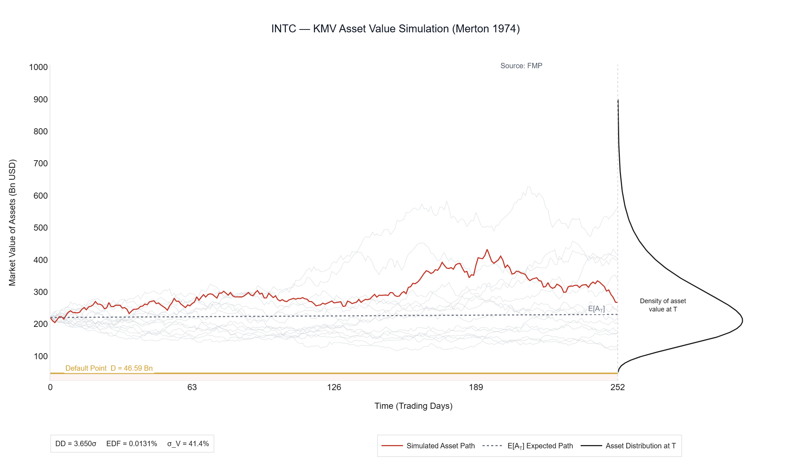
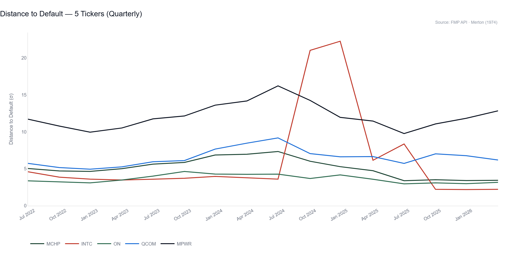
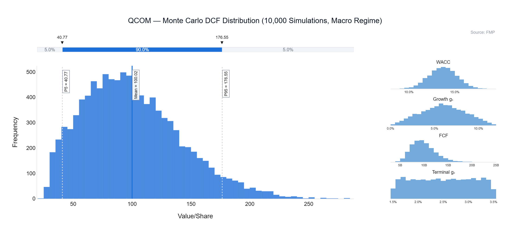

# Semiconductor Risk Analysis

This repository contains quantitative risk models I developed during my Master's in Accounting, Finance & Controlling. I am publishing it as one of several projects in my public portfolio, showcasing applied financial modelling skills in Python for job applications.

The project applies three quantitative risk models to a portfolio of five U.S. semiconductor companies — **MCHP, INTC, ON, QCOM, MPWR** — covering structural credit risk, DCF equity valuation, and Monte Carlo portfolio simulation. Each model is self-contained, reads from a local FMP data cache, and produces terminal output, Plotly charts, and multi-sheet Excel workbooks. Together they answer the questions: *How likely is each company to default? What is the equity fairly worth? And what is the tail risk of holding all five?* All models are calibrated on five years of historical price and fundamental data (June 2021 – June 2026), sourced from the FMP API.

I chose the semiconductor sector because it sits at the intersection of cyclical earnings pressure, high capital intensity, and geopolitical risk — making it an ideal stress-test environment for structural credit risk models. The five tickers span the full credit spectrum: **MPWR** (near-zero debt, DD = 13.9σ) at one extreme and **INTC** (elevated leverage, DD = 3.7σ, IFRS 9 Stage 2) at the other, with **MCHP**, **ON**, and **QCOM** in between — giving the models meaningful differentiation to work with.

---

## Key Results

| Ticker | Company | Rating | Distance to Default | DCF Value/Share | Market Price | Upside | IFRS 9 Stage |
|--------|---------|--------|--------------------:|----------------:|-------------:|-------:|:-------------|
| MCHP | Microchip Technology | BBB | 5.14 | $61.03 | $87.91 | −30.6% | Stage 1 |
| INTC | Intel Corporation | BB | 3.65 | negative | $107.04 | −165.5% | Stage 2 |
| ON | ON Semiconductor | BBB | 4.17 | $56.56 | $110.17 | −48.7% | Stage 1 |
| QCOM | Qualcomm | A | 6.52 | $100.25 | $191.20 | −47.6% | Stage 1 |
| MPWR | Monolithic Power Systems | AAA/AA | 13.88 | $235.54 | $1,473.04 | −84.0% | Stage 1 |

The Monte Carlo simulation (10,000 runs, $\rho$ = 60% sector correlation, three macro regimes) yields a portfolio **`VaR` 99% of 100.57%** (normalized to 100), reflecting that all five names trade at significant premiums to their base-case DCF fair values. The Tornado Chart identifies **`FCF` as the largest uncertainty driver**, with a ±6.6% impact on `VaR` 99% across the P10–P90 range.

---

## Model 1 — Merton Structural Credit Risk

The Merton (1974) model treats a firm's equity as a call option on its assets with the face value of debt as the strike price. Given observed equity market cap and equity volatility, the model iteratively solves for implied asset value and asset volatility using a Black-Scholes framework. The key output is the **Distance to Default ($DD$)** — the number of standard deviations separating current asset value from the default boundary — which maps directly to a risk-neutral **Probability of Default ($PD$)** and a credit spread.

$$DD = \frac{\ln(V/D) + (\mu - \frac{1}{2}\sigma_V^2)T}{\sigma_V\sqrt{T}}$$

IFRS 9 `ECL` integration classifies each borrower into Stage 1 ($DD$ > 4, 12-month `ECL`), Stage 2 ($DD$ 2–4, lifetime `ECL`), or Stage 3 ($DD$ < 2, `LGD` × `EAD`). The model also produces a quarterly **Rating Migration Matrix** showing transition probabilities between rating buckets, an `LGD` sensitivity analysis across Bear/Base/Bull scenarios, and a five-ticker summary Excel workbook.

| Ticker | Company | Distance to Default | Rating | $PD$ (%) | IFRS 9 Stage | Spread (bps) |
|--------|---------|--------------------:|--------|-------:|:-------------|-------------:|
| MCHP | Microchip Technology | 5.14 | BBB | 0.00% | Stage 1 | 63 |
| INTC | Intel Corporation | 3.65 | BB | 0.01% | Stage 2 | 161 |
| ON | ON Semiconductor | 4.17 | BBB | 0.00% | Stage 1 | 94 |
| QCOM | Qualcomm | 6.52 | A | 0.00% | Stage 1 | 22 |
| MPWR | Monolithic Power Systems | 13.88 | AAA/AA | 0.00% | Stage 1 | < 1 |





---

## Model 2 — DCF Valuation & Scenario Analysis

The DCF model values equity using a two-phase discounted cash flow approach: an explicit five-year forecast phase (Phase 1, growth rate $g_1$) and a terminal value (Phase 2, perpetuity at $g_2$). The **`WACC` is computed via `CAPM`** using a 252-day OLS beta against the S&P 500, with debt cost derived from the ratio of interest expense to total debt and a market-value capital structure weighting. Free cash flow is normalized to the five-year median to smooth cyclical distortions — particularly relevant for INTC, which reported negative `FCF` in the most recent fiscal year.

$$WACC = \frac{E}{V} \cdot K_e + \frac{D}{V} \cdot K_d \cdot (1-t)$$

$$EV_{DCF} = \sum_{t=1}^{5} \frac{FCF_t}{(1+WACC)^t} + \frac{FCF_5 \cdot (1+g_2)}{(WACC - g_2) \cdot (1+WACC)^5}$$

Scenario analysis stresses the Base Case along three paths: **Bear** (`WACC` +1.5%, $g_1$ −2%, `FCF` ×0.85), **Base** (unchanged), and **Bull** (`WACC` −1%, $g_1$ +2%, `FCF` ×1.15). A full Peer Group loop computes `WACC`, DCF value, and upside for all five tickers independently, and a Multiples Cross-Check benchmarks EV/EBITDA, P/E, and EV/Sales against semiconductor sector norms (Damodaran, Jan 2025).

Across the four tickers with a positive Base Case valuation, the present value of the terminal value (Phase 2) makes up **57%–65% of total EV_DCF** — MPWR 56.9%, ON 60.1%, QCOM 61.3%, MCHP 65.4% (INTC's Base Case EV is structurally negative, so a terminal value share is not meaningful there). Varying the terminal growth rate $g_2$ by ±1% around the Base Case (2.5%) shifts implied value per share by roughly **±3–4% for MPWR up to ±8–10% for MCHP** across the five tickers. This sensitivity is inversely related to each ticker's WACC-g₂ spread: MPWR's high 17.2% WACC creates a wide buffer against terminal growth assumptions, while MCHP's lower 12.0% WACC leaves less room, amplifying the impact of any change in g₂. Because more than half of every ticker's enterprise value rests on a single long-run growth assumption — one that by construction cannot be observed or back-tested over a short horizon — these DCF valuations are structurally dependent on a parameter with limited empirical anchoring, and should be read as scenario-sensitive estimates rather than precise point values.

| Ticker | Company | `WACC` | Beta | `FCF` Normalized (Bn) | DCF Value/Share | Market Price | Upside |
|--------|---------|-----:|-----:|--------------------:|----------------:|-------------:|-------:|
| MCHP | Microchip Technology | 12.0% | 1.67 | $2.47 | $61.03 | $87.91 | −30.6% |
| QCOM | Qualcomm | 13.7% | 1.88 | $9.85 | $100.25 | $191.20 | −47.6% |
| ON | ON Semiconductor | 14.0% | 2.10 | $1.29 | $56.56 | $110.17 | −48.7% |
| MPWR | Monolithic Power Systems | 17.2% | 2.35 | $0.58 | $235.54 | $1,473.04 | −84.0% |
| INTC | Intel Corporation | 14.3% | 2.46 | −$9.62 | negative | $107.04 | — |

**MCHP Scenario Analysis:**

| Scenario | `WACC` | Growth $g_1$ | Value/Share | Upside vs. Price |
|----------|-----:|----------:|------------:|----------------:|
| Bear | 13.5% | 3.0% | $36.95 | −58.0% |
| Base | 12.0% | 5.0% | $61.03 | −30.6% |
| Bull | 11.0% | 7.0% | $90.58 | +3.0% |

**Scenario Assumptions — Sector Context**

The scenario framework reflects three concrete, dated industry developments rather than abstract macro adjustments.

<table>
<tr>
<th>Bear Case</th>
<th>Base Case</th>
<th>Bull Case</th>
</tr>
<tr>
<td valign="top">

**WACC +1.5%** — PC/smartphone demand softens as memory chip costs rise (IDC); AI capex monetization risk could delay data center buildouts (Deloitte); CHIPS Act Section 48D credit expires Dec 2026 with extension unresolved

</td>
<td valign="top">

**WACC unchanged** — Reflects normal semiconductor cycle, deliberately excluding the AI-specific super-cycle since none of the five tickers are primary AI accelerator suppliers

</td>
<td valign="top">

**WACC −1.0%** — Indirect AI infrastructure spillover into power management, RF/connectivity, and mixed-signal components; Senate draft proposes raising Section 48D credit from 25% to 30%

</td>
</tr>
<tr>
<td valign="top">

**Growth g₁ −2%** — Consumer and industrial end-market exposure (MCHP, ON, QCOM) is more vulnerable to a pricing-driven demand pullback than AI infrastructure suppliers

</td>
<td valign="top">

**Growth g₁ unchanged** — WSTS projects $1.5T industry-wide sales for 2026, but Deloitte estimates AI chips alone account for ~$500B of that — the Base Case does not import this AI-specific growth rate

</td>
<td valign="top">

**Growth g₁ +2%** — Data center buildouts require power management, connectivity, and mixed-signal components even though none of the five tickers are core AI silicon vendors

</td>
</tr>
<tr>
<td valign="top">

**FCF ×0.85** — Operating deleverage as utilization rates fall in a cyclical downturn

</td>
<td valign="top">

**FCF unchanged** — Based on 5-year median, smoothing cyclical distortion without scenario adjustment

</td>
<td valign="top">

**FCF ×1.15** — Operating leverage as utilization rises, reinforced by potential capital cost relief from an extended/expanded investment tax credit

</td>
</tr>
</table>

INTC is a partial exception: its negative normalized FCF reflects company-specific balance sheet issues rather than sector cyclicality, so scenario deltas move INTC's outputs but cannot resolve its structurally negative base valuation.

*Sources: Semiconductor Industry Association / WSTS Spring 2026 Forecast; Deloitte 2026 Semiconductor Industry Outlook; IDC (Jan 2026, via The Straits Times); Semiconductor Industry Association, "Chip Incentives & Investments"; Pillsbury Law, "Senate Draft Tax Bill Expands CHIPS Act Investment Tax Credit" (June 2025).*

---

## Model 3 — Monte Carlo Simulation

The Monte Carlo engine runs 10,000 simulations of DCF equity values across all five tickers simultaneously, using configurable parametric distributions for each input. A **Gaussian copula with Cholesky decomposition** imposes $\rho$ = 60% pairwise correlation across tickers, reflecting the high systematic co-movement of semiconductor stocks. A **macro regime overlay** (Recession 25% / Base 50% / Boom 25%) shifts `WACC`, $g_1$, and `FCF` before each simulation run. The portfolio is held at equal weights (20% each), normalized to 100, and `VaR`/`CVaR` are computed on the resulting loss distribution.

The **Convergence Test** confirms `VaR` 99% stabilizes above 5,000 simulations (Δ < 0.1%). The **Tornado Chart** isolates the contribution of each parameter by varying it from P10 to P90 while holding all others at their mean — `FCF` variability dominates, followed by `WACC` uncertainty.

Each parameter's distribution shape reflects a specific assumption about its empirical behavior rather than a default choice. `WACC` uses a **Normal** distribution because its underlying components (cost of equity, cost of debt) are approximately symmetric around their expected value with no known skew — the standard approach in practice. $g_1$ uses a **Triangular** distribution, deliberately chosen because the available information is a plausible range (0% floor, no negative growth assumed) and a most-likely value rather than a fully estimated distribution shape — the 12% ceiling reflects historical semiconductor sector growth rates. `FCF` uses a **Log-Normal** distribution to capture the right-skew typical of cash flow shocks, where large positive surprises are more likely than symmetric extremes in either direction. $g_2$ uses a **Uniform** distribution between a plausible floor and ceiling close to long-run GDP growth, deliberately encoding maximum uncertainty without favoring any value within that range — the most conservative assumption available when only the bounds, not the shape, are known.

**Parameter Distributions:**

| Parameter | Distribution | E[X] | P10 | P90 |
|-----------|-------------|-----:|----:|----:|
| `WACC` | Normal ($\sigma$ = 1.5%) | 12.0% | 10.1% | 13.9% |
| $g_1$ (Phase 1 growth) | Triangular (0%, mode, 12%) | 5.0% | 2.4% | 9.0% |
| `FCF` | Log-Normal ($\sigma$ = 25%) | $2.47 Bn | $1.75 Bn | $3.34 Bn |
| $g_2$ (Terminal growth) | Uniform (1.5%–3.5%) | 2.5% | 1.7% | 3.3% |

**Portfolio Risk (MCHP/INTC/ON/QCOM/MPWR, equal weight, normalized to 100):**

| Metric | Value |
|--------|------:|
| Portfolio Median | 21.84 |
| `VaR` 95% | 96.16% loss |
| `VaR` 99% | 100.57% loss |
| `CVaR` 99% (Expected Shortfall) | 102.51% loss |
| Diversification Effect vs. Single Names | 27.6% Std reduction |
| Largest Uncertainty Driver | `FCF` (±6.6% impact on `VaR` 99%) |



The table below translates each ticker's simulated loss distribution into VaR/CVaR terms relative to its current market price (100% = no loss; values above 100% mean the simulated DCF value turns negative in the tail). **INTC stands out with materially higher risk** — its negative free cash flow pulls a large share of the simulated distribution below zero, pushing VaR/CVaR figures far beyond the other four names. Because INTC's mean FCF is negative, the Log-Normal sampling — which requires a positive mean — falls back to a Normal distribution centered on that negative mean, with the standard deviation scaled to the same magnitude (|mean| × 25%) rather than a fixed value, preserving the intended relative uncertainty without requiring a sign change in the input. The **portfolio VaR 99% (100.6%) sits below the average of the single-name VaRs**, which is the concrete evidence of the diversification effect from spreading across five tickers even under a 60% sector correlation assumption.

| Ticker | VaR 95% | VaR 99% | CVaR 99% |
|---|---|---|---|
| MCHP | 76.6% | 83.0% | 84.2% |
| INTC | 206.6% | 227.4% | 242.2% |
| ON | 79.0% | 84.0% | 85.1% |
| QCOM | 78.7% | 83.4% | 84.4% |
| MPWR | 92.2% | 93.4% | 93.7% |
| **Portfolio** | **96.2%** | **100.6%** | **102.5%** |

---

## Tech Stack

Python 3.14 · pandas · numpy · scipy · plotly · openpyxl

```bash
git clone https://github.com/carlos-schwiening/semiconductor-risk-analysis
cd semiconductor-risk-analysis
pip install pandas numpy scipy plotly openpyxl
python Merton/Merton_Model.py
python DCF/DCF_Valuation.py
python MCS/Monte_Carlo_Sim.py
```

Each script is self-contained and runs against a local FMP cache. Set `ACTIVE_CONFIG` at the top of each file to switch the active ticker.

---

## Data

Price history, balance sheet, income statement, cash flow, and key metrics are sourced from the **Financial Modeling Prep (FMP) API** (`/stable/` endpoints) and cached locally as JSON files before processing. No API key is stored in this repository — the key is read from a local `Config/Api_keys.py` file excluded via `.gitignore`. The S&P 500 price series used for beta estimation is cached as `SP500_historical-price-eod_full.json`.

---

## Author

**Carlos Schwiening** — MSc Accounting, Finance & Controlling  
GitHub: [carlos-schwiening](https://github.com/carlos-schwiening)
