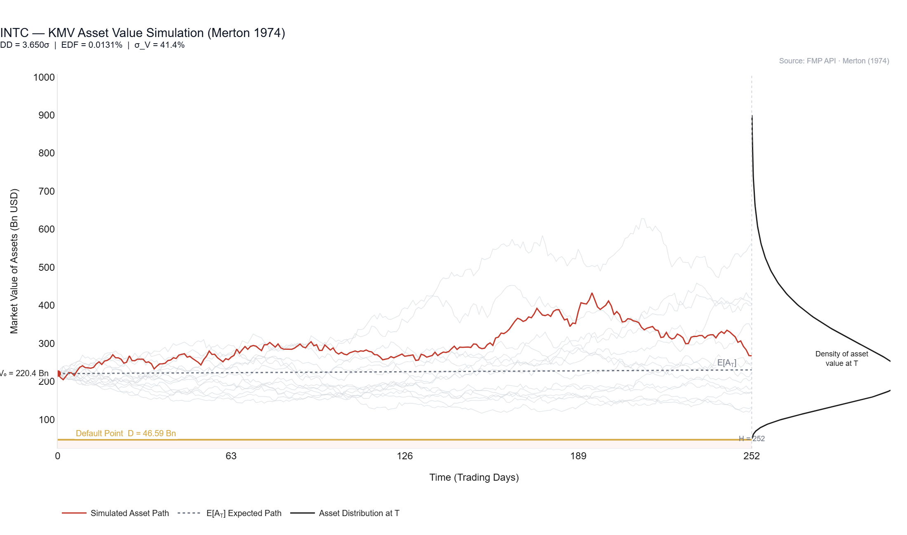
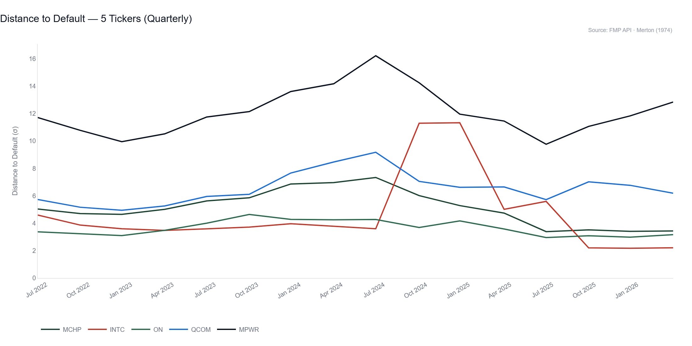
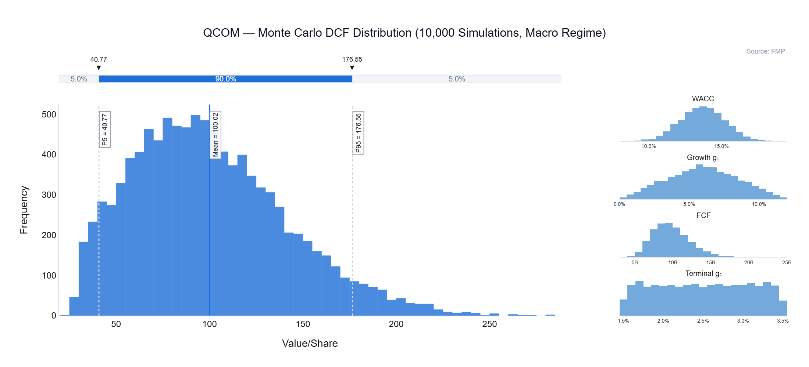

# Semiconductor Risk Analysis

[](https://github.com/carlos-schwiening/semiconductor-risk-analysis/actions/workflows/ci.yml)

This repository contains quantitative risk models I developed during my Master's in Accounting, Finance & Controlling. I am publishing it as one of several projects in my public portfolio, showcasing applied financial modelling skills in Python for job applications.

The project applies three quantitative risk models to a portfolio of five U.S. semiconductor companies — MCHP, INTC, ON, QCOM, MPWR — covering structural credit risk, DCF equity valuation, and Monte Carlo portfolio simulation. Each model is self-contained, reads from a local FMP data cache, and produces terminal output, Plotly charts, and multi-sheet Excel workbooks. Together they answer the questions: *How likely is each company to default? What is the equity fairly worth? And what is the tail risk of holding all five?* All models are calibrated on five years of historical price and fundamental data (June 2021 – June 2026), sourced from the FMP API.

I chose the semiconductor sector because it sits at the intersection of cyclical earnings pressure, high capital intensity, and geopolitical risk — making it an ideal stress-test environment for structural credit risk models. The five tickers span the full credit spectrum: MPWR (near-zero debt, DD = 13.9σ) at one extreme and INTC (elevated leverage, DD = 3.7σ, IFRS 9 Stage 2) at the other, with MCHP, ON, and QCOM in between — giving the models meaningful differentiation to work with.

---

## Key Results

| Ticker | Company | Distance to Default | DCF Value/Share | Market Price | Upside | IFRS 9 Stage |
|--------|---------|--------------------:|----------------:|-------------:|-------:|:-------------|
| MCHP | Microchip Technology | 5.14 | $61.03 | $87.91 | −30.6% | Stage 1 |
| INTC | Intel Corporation | 3.65 | not applicable ¹ | $107.04 | — | Stage 2 |
| ON | ON Semiconductor | 4.17 | $56.56 | $110.17 | −48.7% | Stage 1 |
| QCOM | Qualcomm | 6.52 | $100.25 | $191.20 | −47.6% | Stage 1 |
| MPWR | Monolithic Power Systems | 13.88 | $235.54 | $1,473.04 | −84.0% | Stage 1 |

¹ INTC's normalized free cash flow is −$9.62 Bn. A DCF discounts the cash a company is expected to generate, so a negative starting point yields the present value of continued cash burn — arithmetically −$70.11 per share, or −165.5% "upside" — rather than an intrinsic value. Reporting that number as a valuation would be a category error, so the model states the limitation instead and points to the two measures that do carry information for INTC: the Merton credit model (Stage 2, `DD` = 3.65) and the multiples cross-check.

The Monte Carlo simulation (10,000 runs, $\rho$ = 60% sector correlation, three macro regimes) yields a portfolio `VaR` 99% of 84.57% (normalized to 100) across the four tickers whose DCF applies, reflecting that they all trade at significant premiums to their base-case DCF fair values. The Tornado Chart identifies `FCF` as the largest uncertainty driver, moving `VaR` 99% by 21.3 percentage points across its P10–P90 range.

---

## Model 1 — Merton Structural Credit Risk

The Merton (1974) model treats a firm's equity as a call option on its assets with the face value of debt as the strike price. Given observed equity market cap and equity volatility, the model iteratively solves for implied asset value and asset volatility using a Black-Scholes framework. The key output is the Distance to Default ($DD$) — the number of standard deviations separating current asset value from the default boundary — which maps directly to a risk-neutral Probability of Default ($PD$) and a credit spread.

$$DD = \frac{\ln(V/D) + (r - \frac{1}{2}\sigma_V^2)T}{\sigma_V\sqrt{T}}$$

The drift term is the risk-free rate $r$, not an estimated real-world asset drift $\mu$. That makes the resulting $PD$ a risk-neutral one, consistent with the credit spread derived from it further below; a real-world $PD$ would need an expected asset return the model does not estimate.

IFRS 9 `ECL` integration classifies each borrower into Stage 1 ($DD$ > 4, 12-month `ECL`), Stage 2 ($DD$ 2–4, lifetime `ECL`), or Stage 3 ($DD$ < 2, `LGD` × `EAD`). This is a deliberate simplification and departs from the standard in one respect worth stating: IFRS 9 triggers Stage 2 on a *significant increase in credit risk since initial recognition* — a relative test against the exposure's own starting point — whereas absolute `DD` thresholds are used here. That trade is made knowingly: a relative test needs an origination date and a credit-risk history per exposure, which a market-data model of listed equity does not have. The staging should therefore be read as a credit-quality bucket, not as an audit-ready IFRS 9 classification. The model also produces a quarterly migration matrix showing transition probabilities between `DD` bands, an `LGD` sensitivity analysis across Bear/Base/Bull scenarios, and a five-ticker summary Excel workbook.

| Ticker | Company | Distance to Default | DD Band | IFRS 9 Stage | Model Spread (bps) |
|--------|---------|--------------------:|---------|:-------------|-------------------:|
| MCHP | Microchip Technology | 5.14 | DD 4-6 | Stage 1 | 0.0 |
| INTC | Intel Corporation | 3.65 | DD 2-4 | Stage 2 | 0.6 |
| ON | ON Semiconductor | 4.17 | DD 4-6 | Stage 1 | 0.1 |
| QCOM | Qualcomm | 6.52 | DD 6-8 | Stage 1 | 0.0 |
| MPWR | Monolithic Power Systems | 13.88 | DD > 8 | Stage 1 | 0.0 |

**There are no rating letters here, and that is deliberate.** An earlier version of this table mapped `DD` onto AAA/BBB/CCC labels and set them beside agency ratings. The mapping had no source — the band edges 8, 6, 4, 2, 1 were chosen, from no publication — so the comparison graded the model on a scale this project had invented.

Calibrating those edges against observed default rates does not rescue it either. Inverting S&P's one-year 1981–2024 figures through `N(−DD)` collapses AA through BBB into `DD` 2.99 to 3.54, a span of 0.55, and AAA does not map at all because its observed rate is 0.00%. Above that the normal distribution calls default effectively impossible, which is exactly why `PD` 1Y prints 0.0000% for QCOM and MPWR. Moody's KMV hit the same wall and answered it by discarding `N(−DD)` for an empirically estimated default frequency — which needs a default database, not a better threshold.

So the letters are gone and the bands are what they always were: buckets for reporting `DD`. Their edges are still chosen, but a bucket boundary is not a claim — every histogram picks its own. Estimating where default risk actually changes is the job of the companion project [credit-risk-validation](https://github.com/carlos-schwiening/credit-risk-validation), which collects realised defaults across hundreds of filers.

The market benchmark column went with them. Market spreads are quoted per rating class, so comparing the Merton spread against one requires assigning a rating — the very step this model cannot support.

**Where the model earns its keep: the five-year horizon.** The one-year `PD` is near zero for every investment-grade issuer here, which says more about the horizon than about the companies. The five-year `PD` — the same model, run at $T=5$, and the figure already driving the lifetime `ECL` — lands close to observed cumulative default rates:

| Ticker | S&P class compared against | $PD$ 1Y (model) | $PD$ 1Y (observed) | $PD$ 5Y (model) | $PD$ 5Y (observed) |
|--------|----------------------------|----------------:|-------------------:|----------------:|-------------------:|
| MCHP | BBB | 0.0000% | 0.14% | **1.95%** | 1.36% |
| QCOM | A | 0.0000% | 0.05% | **0.33%** | 0.39% |
| INTC | BB | 0.0131% | 0.56% | **9.82%** | 5.75% |
| ON | BBB | 0.0015% | 0.14% | **6.40%** | 1.36% |
| MPWR | AAA/AA | 0.0000% | 0.00–0.02% | 0.00% | 0.28–0.34% |

*Observed = S&P Global Ratings, **2024 Annual Global Corporate Default And Rating Transition Study** (27 March 2025), Table 24 — global corporate average cumulative default rates, 1981–2024. Every figure comes from that one edition; see [SOURCES.md](SOURCES.md) #5 for why that matters. AAA and AA are listed separately there, hence the range for MPWR's bucket.*

Three of the five land in the right neighbourhood at five years, which is the more meaningful validation of a structural model than any one-year figure. ON is the exception and worth naming: its five-year `PD` of 6.40% is nearly five times the BBB benchmark, so the model's own outputs disagree with each other — the `DD` band and the IFRS 9 stage come from the one-year figure, the lifetime `ECL` from the five-year one, and for ON those two tell different stories. MPWR's 0.00% reflects a firm with almost no debt, where the structural model has nothing to price.

**The model prices almost no credit risk at a one-year horizon, and that gap is a result rather than an error.** The theoretical spread follows from the risk-neutral $PD$ via $s = -\ln(1 - PD \cdot LGD)\,/\,T$, and a $DD$ of 5.14 corresponds to a $PD$ of roughly $10^{-7}$. Observed market spreads compensate for liquidity, recovery uncertainty and jump-to-default risk that a diffusion process cannot represent — the well-documented credit spread puzzle of structural models at short horizons. The informative content of the Merton model here is the $DD$ ranking and the IFRS 9 staging, not the absolute spread level.





---

## Model 2 — DCF Valuation & Scenario Analysis

The DCF model values equity using a two-phase discounted cash flow approach: an explicit five-year forecast phase (Phase 1, growth rate $g_1$) and a terminal value (Phase 2, perpetuity at $g_2$). The `WACC` is computed via `CAPM` using a 252-day OLS beta against the S&P 500, with debt cost derived from the ratio of interest expense to total debt and a market-value capital structure weighting. Free cash flow is normalized to the five-year median to smooth cyclical distortions. That works for the four cyclical names; it does not rescue INTC, whose median across the five years is itself negative (−$9.62 Bn), which is why the DCF is reported as not applicable there rather than normalized into a positive figure.

$$WACC = \frac{E}{V} \cdot K_e + \frac{D}{V} \cdot K_d \cdot (1-t)$$

**The resulting discount rates sit above sector norms, and that drives much of the result.** The 252-day betas come out between 1.67 and 2.46, against Damodaran's January 2026 reference of 1.52 for Semiconductor (66 firms) and 1.40 for Semiconductor Equipment (31 firms). With a 4.3% risk-free rate and a 5.5% equity risk premium that yields a cost of equity of 13.5%–17.8%, where the reference betas imply 12.0%–12.7%. A discount rate one and a half to five points above the reference is a large part of why all five names come out overvalued — a one-year daily beta is a noisy estimator, and the 2025/26 window contains unusually large idiosyncratic moves for these stocks. The scenario analysis below varies `WACC` by ±1.0–1.5 percentage points, which brackets part but not all of that gap.

$$EV_{DCF} = \sum_{t=1}^{5} \frac{FCF_t}{(1+WACC)^t} + \frac{FCF_5 \cdot (1+g_2)}{(WACC - g_2) \cdot (1+WACC)^5}$$

Scenario analysis stresses the Base Case along three paths, and a peer loop runs `WACC`, DCF value and upside for all five tickers independently:

| Scenario | `WACC` | Growth $g_1$ | `FCF` |
|----------|--------|--------------|-------|
| Bear | +1.5pp | −2pp | ×0.85 |
| Base | unchanged | unchanged | unchanged |
| Bull | −1.0pp | +2pp | ×1.15 |

A multiples cross-check benchmarks EV/EBITDA, P/E and EV/Sales against sector norms (Damodaran, January 2026).

**Reading the DCF and the multiples as two valuations is the mistake to avoid.** They use different bases on purpose: the DCF normalizes free cash flow over five years to smooth the cycle, the multiples are computed on the most recent fiscal year. In a trough year that inflates them sharply — MCHP's P/E of 173x reflects collapsed trailing earnings, not a 173-year payback. The cross-check tests current market pricing, not the DCF.

**More than half of every valuation rests on the terminal value.** Phase 2's share of `EV_DCF`:

| Ticker | Terminal share | `WACC` |
|--------|---------------:|-------:|
| MPWR | 56.9% | 17.2% |
| ON | 60.1% | 14.0% |
| QCOM | 61.3% | 13.7% |
| MCHP | 65.4% | 12.0% |

INTC is absent because its Base Case EV is structurally negative, which makes a terminal share meaningless rather than merely unavailable.

Moving $g_2$ by ±1pp around the 2.5% Base Case shifts value per share by roughly ±3–4% (MPWR) to ±8–10% (MCHP). The spread tracks `WACC` − $g_2$: MPWR's 17.2% `WACC` buys a wide buffer, MCHP's 12.0% leaves little. A long-run growth rate cannot be observed or back-tested over any horizon available here, so these are scenario-sensitive estimates and not point values.

| Ticker | Company | `WACC` | Beta | `FCF` Normalized (Bn) | DCF Value/Share | Market Price | Upside |
|--------|---------|-----:|-----:|--------------------:|----------------:|-------------:|-------:|
| MCHP | Microchip Technology | 12.0% | 1.67 | $2.47 | $61.03 | $87.91 | −30.6% |
| QCOM | Qualcomm | 13.7% | 1.88 | $9.85 | $100.25 | $191.20 | −47.6% |
| ON | ON Semiconductor | 14.0% | 2.10 | $1.29 | $56.56 | $110.17 | −48.7% |
| MPWR | Monolithic Power Systems | 17.2% | 2.35 | $0.58 | $235.54 | $1,473.04 | −84.0% |
| INTC | Intel Corporation | 14.3% | 2.46 | −$9.62 | not applicable | $107.04 | — |

**MCHP Scenario Analysis:**

| Scenario | `WACC` | Growth $g_1$ | Value/Share | Upside vs. Price |
|----------|-----:|----------:|------------:|----------------:|
| Bear | 13.5% | 3.0% | $36.95 | −58.0% |
| Base | 12.0% | 5.0% | $61.03 | −30.6% |
| Bull | 11.0% | 7.0% | $90.58 | +3.0% |

**Scenario Assumptions — Sector Context**

The scenario framework reflects three concrete, dated industry developments rather than abstract macro adjustments.

<table>
<tr>
<th>Bear Case</th>
<th>Base Case</th>
<th>Bull Case</th>
</tr>
<tr>
<td valign="top">

**WACC +1.5%** — PC/smartphone demand softens as memory chip costs rise (IDC); AI capex monetization risk could delay data center buildouts (Deloitte); CHIPS Act Section 48D credit expires Dec 2026 with extension unresolved

</td>
<td valign="top">

**WACC unchanged** — Reflects normal semiconductor cycle, deliberately excluding the AI-specific super-cycle since none of the five tickers are primary AI accelerator suppliers

</td>
<td valign="top">

**WACC −1.0%** — Indirect AI infrastructure spillover into power management, RF/connectivity, and mixed-signal components; Senate draft proposes raising Section 48D credit from 25% to 30%

</td>
</tr>
<tr>
<td valign="top">

**Growth g₁ −2%** — Consumer and industrial end-market exposure (MCHP, ON, QCOM) is more vulnerable to a pricing-driven demand pullback than AI infrastructure suppliers

</td>
<td valign="top">

**Growth g₁ unchanged** — WSTS projects $1.5T industry-wide sales for 2026, but Deloitte estimates AI chips alone account for ~$500B of that — the Base Case does not import this AI-specific growth rate

</td>
<td valign="top">

**Growth g₁ +2%** — Data center buildouts require power management, connectivity, and mixed-signal components even though none of the five tickers are core AI silicon vendors

</td>
</tr>
<tr>
<td valign="top">

**FCF ×0.85** — Operating deleverage as utilization rates fall in a cyclical downturn

</td>
<td valign="top">

**FCF unchanged** — Based on 5-year median, smoothing cyclical distortion without scenario adjustment

</td>
<td valign="top">

**FCF ×1.15** — Operating leverage as utilization rises, reinforced by potential capital cost relief from an extended/expanded investment tax credit

</td>
</tr>
</table>

INTC is a partial exception: its negative normalized FCF reflects company-specific balance sheet issues rather than sector cyclicality, so scenario deltas move INTC's outputs but cannot resolve its structurally negative base valuation.

*Sources: Semiconductor Industry Association / WSTS Spring 2026 Forecast; Deloitte 2026 Semiconductor Industry Outlook; IDC (Jan 2026, via The Straits Times); Semiconductor Industry Association, "Chip Incentives & Investments"; Pillsbury Law, "Senate Draft Tax Bill Expands CHIPS Act Investment Tax Credit" (June 2025).*

---

## Model 3 — Monte Carlo Simulation

The Monte Carlo engine runs 10,000 simulations of DCF equity values across all five tickers simultaneously, using configurable parametric distributions for each input. A Gaussian copula with Cholesky decomposition imposes $\rho$ = 60% pairwise correlation across tickers, reflecting the high systematic co-movement of semiconductor stocks. A macro regime overlay (Recession 25% / Base 50% / Boom 25%) shifts `WACC`, $g_1$, and `FCF` before each simulation run. All five tickers are simulated; the reported portfolio holds the four with an applicable DCF at equal weights (25% each), normalized to 100, and `VaR`/`CVaR` are computed on the resulting loss distribution. The equal-weighted five-ticker variant is shown alongside it for reference — see the footnotes to the per-ticker table.

The Convergence Test confirms `VaR` 99% stabilizes beyond 5,000 simulations: the step from 7,500 to 10,000 moves it by 0.005 pp, against 0.4–0.6 pp between the smallest sample sizes. The Tornado Chart isolates the contribution of each parameter by varying it from P10 to P90 while holding all others at their mean:

| Parameter | `VaR` 99% @ P10 | `VaR` 99% @ P90 | Swing |
|---|---:|---:|---:|
| `FCF` | 82.2% | 60.9% | 21.3 pp |
| `WACC` | 62.0% | 78.4% | 16.4 pp |
| $g_1$ | 74.0% | 67.4% | 6.6 pp |
| $g_2$ | 73.7% | 69.6% | 4.2 pp |

`FCF` uncertainty dominates, followed by `WACC`. The tornado runs without the macro regime overlay in order to isolate the four input parameters, so its base `VaR` 99% of 72.2% differs from the 84.6% reported above — read the swings as relative contributions, not as deltas on the headline figure.

**Each distribution shape encodes a claim about the parameter, not a default choice:**

| Parameter | Distribution | E[X] | P10 | P90 | Why this shape |
|-----------|-------------|-----:|----:|----:|----------------|
| `WACC` | Normal ($\sigma$ = 1.5%) | 12.0% | 10.1% | 13.9% | Cost of equity and cost of debt are roughly symmetric around their expected value, with no known skew |
| $g_1$ (Phase 1 growth) | Triangular (0%, mode, 12%) | 5.0% | 2.4% | 9.0% | A plausible range and a most-likely value is all that is known; the 12% ceiling is historical sector growth |
| `FCF` | Log-Normal ($\sigma$ = 25%) | $2.47 Bn | $1.75 Bn | $3.34 Bn | Cash flow shocks skew right — large positive surprises outweigh symmetric extremes |
| $g_2$ (Terminal growth) | Uniform (1.5%–3.5%) | 2.5% | 1.7% | 3.3% | Only the bounds are known, so no value between them is favoured |

**Portfolio Risk (MCHP/ON/QCOM/MPWR, equal weight, normalized to 100):**

| Metric | Value |
|--------|------:|
| Portfolio Median | 46.05 |
| `VaR` 95% | 80.44% loss |
| `VaR` 99% | 84.57% loss |
| `CVaR` 99% (Expected Shortfall) | 85.77% loss |
| Diversification Effect vs. Single Names | 6.3% Std reduction |
| Largest Uncertainty Driver | `FCF` (21.3 pp swing in `VaR` 99%) |

**Limited liability caps the loss at 100%.** A simulated equity value is floored at zero before it enters the loss distribution, because a shareholder can lose the capital invested but no more. This is the same assumption Model 1 rests on, where equity is priced as a call option with payoff $\max(V-D,\,0)$ — the three models share it rather than each making its own.



The table below translates each ticker's simulated loss distribution into VaR/CVaR terms relative to its current market price (100% = no loss, 100% = total loss).

| Ticker | VaR 95% | VaR 99% | CVaR 99% |
|---|---|---|---|
| MCHP | 76.6% | 83.0% | 84.2% |
| INTC | — ¹ | — ¹ | — ¹ |
| ON | 79.0% | 84.0% | 85.1% |
| QCOM | 78.7% | 83.4% | 84.4% |
| MPWR | 92.2% | 93.4% | 93.7% |
| **Portfolio** (4 tickers, 25% each) | **80.4%** | **84.6%** | **85.8%** |
| *All five, for reference* ² | *84.4%* | *87.7%* | *88.6%* |

¹ **No DCF-based risk measure is reported for INTC, because the model that would produce it does not apply.** Its normalized `FCF` is −$9.62 Bn, so every simulated equity value comes out negative and the floor sends all 10,000 draws to a total loss. Printing the resulting 100% would state something the model cannot support and would read as a certain default — while the Merton model in this same repository puts INTC's one-year `PD` at 0.0131%. Model 1 is the applicable tool here, and it does rank INTC as the weakest of the five (`DD` = 3.65, IFRS 9 Stage 2) without needing a cash flow forecast at all. Where one model reaches its limit, another still answers, which is the reason for running all three. (On the sampling: Log-Normal draws require a positive mean, so `FCF` falls back to a Normal distribution centred on the negative mean with its standard deviation scaled to the same magnitude, |mean| × 25% — the intended relative uncertainty is preserved without a sign change.)

² Kept visible rather than dropped: including INTC pins a fifth of the portfolio at total loss by construction, which is why the four-ticker figure is the one reported. INTC is excluded from this measure only — it remains fully part of the study in Models 1 and 2.

**The diversification effect is small — 6.3% standard deviation reduction — and that is the expected outcome.** All five companies come from one sector, and the model itself imposes 60% pairwise correlation between them. Diversification arises from combining assets that move independently, which is precisely what this portfolio does not do. The number is consistent with the deliberate design of the study: the semiconductor sector was chosen for its concentration and cyclicality in order to stress-test the credit models, not to build a diversified portfolio. Computing the same measure over only the four tickers with an applicable DCF yields 6.3% as well, so the result does not hinge on how INTC is handled.

---

## Tech Stack

Python 3.12+ (CI runs 3.12 and 3.13) · pandas · numpy · scipy · plotly · openpyxl

```bash
git clone https://github.com/carlos-schwiening/semiconductor-risk-analysis
cd semiconductor-risk-analysis
pip install -e .
python Merton/Merton_Model.py --ticker MCHP
python DCF/DCF_Valuation.py --ticker MCHP
python MCS/Monte_Carlo_Sim.py --ticker MCHP
```

- `pip install -e .` installs the project as a package, so `Merton`, `DCF`, `MCS` and `Config` import without path hacks.
- `--ticker` picks the issuer: `MCHP` | `INTC` | `ON` | `QCOM` | `MPWR`, default `MCHP`. No code editing.
- Multi-ticker blocks ignore it. `Merton_Report.py`, the DCF peer-group comparison and the correlated Monte Carlo portfolio always run all five.
- Generated artefacts go to `Outputs/`, which is excluded from version control.

**The models read a local FMP cache, never the API.** The default location is `data/FMP_Cache/` inside the project; point `FMP_CACHE_DIR` at your own if it lives elsewhere:

```bash
export FMP_CACHE_DIR=/path/to/FMP_Cache          # macOS / Linux
setx FMP_CACHE_DIR "D:\path\to\FMP_Cache"        # Windows, once
```

That is not only a convenience. FMP's free tier answers the price and statement endpoints with HTTP 402, so a clone without a cache cannot rebuild one — the cached JSON is the data source, not a copy of it. Reproducing these figures from scratch needs a paid key.

---

## Code Structure

Each model is split into a pure calculation module and a script that orchestrates it. The calculation modules take numbers and return numbers — no file access, no API calls, no charts — which is what makes them unit-testable and keeps a single formula from drifting apart across scripts.

```
Merton/merton_core.py   Merton model, rating table, credit spread
DCF/dcf_core.py         Two-phase DCF, CAPM, sensitivities, Monte Carlo, classifiers
DCF/fmp_extract.py      Cache access and FMP field mapping
```

`fmp_extract.py` is the only module that knows FMP field names. The calculation modules never see them, so replacing the data provider means changing that one file. The remaining scripts (`Merton_Model.py`, `DCF_Valuation.py`, `DCF_Report.py`, `Monte_Carlo_Sim.py`) load data, call the core modules, and handle output.

## Verifying the published figures

```bash
python verify.py            # constants, configuration, structural facts
python verify.py --full     # also re-runs the models over the cached data
```

`verify.py` reads the published values *out of this file* rather than restating
them, so a claim cannot quietly agree with itself. With `--full` and
`FMP_CACHE_DIR` set it re-runs the Merton model per ticker and checks the **Key
Results** Distance to Default figures against freshly computed ones.

A number typed into a README has no connection to the code that produced it and
goes stale silently. This one claimed 51 tests for months after the suite had
grown to 88. Four of five agency ratings, since removed, were wrong for longer.
Neither was noticed, because nothing was checking.

A mismatch is a **finding, not an annoyance**: either the source moved or the
code did, and which one has to be established before either number is corrected.

Three figures are named as **not checkable by code** and printed after every run —
the S&P observed default rates and the two Damodaran sector references all
originate outside this repository.

## Tests & Continuous Integration

[GitHub Actions](.github/workflows/ci.yml) runs on every push to `main`:

- **88 tests** (`python -m pytest`) over the calculation modules. Deterministic functions are checked against closed-form results — with zero growth the DCF must collapse to `FCF / WACC`, and enterprise value must not depend on how the cash flows are split between forecast and terminal phase. Stochastic functions are tested on properties instead of fixed values: reproducibility under a fixed seed, correct ordering of the output range, wider dispersion under wider inputs. The Monte Carlo tests assert impossibilities rather than values — a loss above 100% of the invested amount, a conditional VaR below its own VaR, a scenario the model could not evaluate counted as a total loss.
- **mypy** across every Python file in `Merton/`, `DCF/` and `MCS/`, plot scripts included. `mypy.ini` sets `disallow_untyped_defs`, because mypy otherwise skips the bodies of unannotated functions — a green run without that flag says considerably less than it appears to.

Both run in a clean environment on Ubuntu with Python 3.12, so a dependency that happens to be installed locally cannot mask a missing entry in `pyproject.toml`.

---

## Data

- **FMP** (`/stable/` endpoints) — price history, balance sheet, income statement, cash flow, key metrics. Cached as JSON before processing.
- **S&P 500** price series for beta estimation, cached as `SP500_historical-price-eod_full.json`.
- **No API key in this repository.** It is read from `Config/Api_keys.py`, excluded via `.gitignore`.

**[SOURCES.md](SOURCES.md)** covers each source on its own: what it feeds, a browser link to check it without running anything, and the limits that actually bind — silent truncation above 5,000 rows, prices that are not dividend-adjusted, sector averages that are a yardstick rather than a correction.

---

## Author

**Carlos Schwiening** — MSc Accounting, Finance & Controlling  
GitHub: [carlos-schwiening](https://github.com/carlos-schwiening)

---

## References

Bolder, David Jamieson (2018): Credit-Risk Modelling. Theoretical Foundations, Diagnostic Tools, Practical Examples, and Numerical Recipes in Python. 1st ed. Cham: Springer International Publishing.

Desmettre, Sascha; Korn, Ralf (2018): Erweiterungen des Black-Scholes-Modells, Zins, Kreditrisiko und Statistik. Wiesbaden: Springer Spektrum (Studienbücher Wirtschaftsmathematik, Band 2).

Gleißner, Werner (2019): Risikoaggregation und Monte-Carlo-Simulation: Schlüsseltechnologie für Risikomanagement und Controlling. 1. Auflage. Wiesbaden: Springer Verlag.

IDW – Institut der Wirtschaftsprüfer in Deutschland e. V. (2017): Grundsätze zur Durchführung von Unternehmensbewertungen (IDW S 1 i.d.F. 2008). Düsseldorf.

Merton, Robert C. (1974): On the Pricing of Corporate Debt: The Risk Structure of Interest Rates. In: The Journal of Finance, Vol. 29, No. 2, pp. 449-470.

Witzany, Jiří (2017): Credit Risk Management. Pricing, Measurement, and Modeling. 1st ed. Cham: Springer International Publishing.

Zieliński, Tomasz: Merton's and KMV Models in Credit Risk Management. University of Economics in Katowice.
